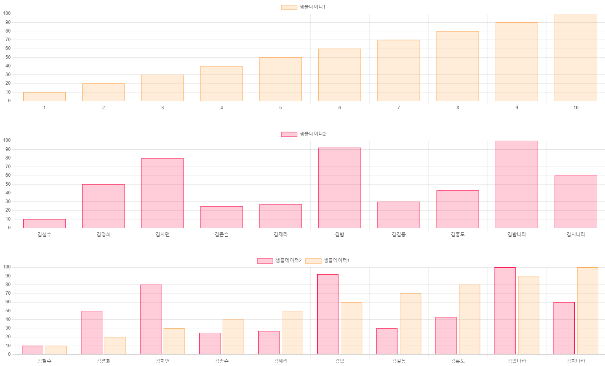

# BasicChartJS

> 공통함수화로 코드의 재사용을 최소화.



## 파일
> chartJS는 최신버전 사용을 권장, 내장된 chartJS를 기반으로 만든 basicChartJS파일임.

1. chart.js 관련 js파일
2. basicChartJS 파일
3. 예제 HTML파일

## 구현기능
- 기본옵션을 반응형으로 변경
- BarChart기준으로 쉬운사용

## 사용 순서
0. `$.extend(true,<TARGET>,basicChartJS);`으로 덮어씌워 사용
1. `canvas` 상위태그에 대한 뷰포트 지정(`canvas`에 지정하면 차트가 깨지는 문제가 있음.)
2. `init`으로 chart가 보여질 태그ID지정
3. `getData`으로 `Ajax`(혹은 다른방법)데이터를 가져옴
4. `draw`으로 차트를 그림

## ChartJS의 옵션들
> 공통 테이블의 기본 옵션변경 및 옵션추가를 하려면 `basicChartJS`에서 기본 속성을 변경할 수 있음.

🔍[ChartJS Docs](https://www.chartjs.org/docs/latest/)

## 문제점
- 원형차트 등은 미구현(~~아직 쓸일이 없었음.~~)

## getData -> ajax 사용법
```JavaScript
var sampleData = []
var testChart = {
    ...,
    getData: function(){
        $.ajax({
            url: 'url',
            method: 'get || post || ...',
            contentType:"application/json",
            ...
            success: function (data, status, xhr) {
                this.chartDataSets = [
                    {
                        label: ${라벨},
                        data: ${데이터},
                        backgroundColor: ['rgba(255, 159, 64, 0.2)'],
                        borderColor: ['rgb(255, 159, 64)'],
                        borderWidth: 1
                    }
                ];
                this.chartLabels= ${데이터에 대한 라벨}
                this.chartOptions= {
                    maintainAspectRatio: false,
                    scales: {
                        y: {
                            beginAtZero: true
                        }
                    }
                }
                this.draw();

            },
            error: function (data, status, err) {
                ...
            },
            complete: function () {
                ...
            }
        });
    }
}
```

> 데이터형식에 따라 `setListDataLabel` 함수를 사용할 수 있음(예제참고)

## CHART JS LICENSE
```
The MIT License (MIT)

Copyright (c) 2014-2024 Chart.js Contributors

Permission is hereby granted, free of charge, to any person obtaining a copy of this software and associated documentation files (the "Software"), to deal in the Software without restriction, including without limitation the rights to use, copy, modify, merge, publish, distribute, sublicense, and/or sell copies of the Software, and to permit persons to whom the Software is furnished to do so, subject to the following conditions:

The above copyright notice and this permission notice shall be included in all copies or substantial portions of the Software.

THE SOFTWARE IS PROVIDED "AS IS", WITHOUT WARRANTY OF ANY KIND, EXPRESS OR IMPLIED, INCLUDING BUT NOT LIMITED TO THE WARRANTIES OF MERCHANTABILITY, FITNESS FOR A PARTICULAR PURPOSE AND NONINFRINGEMENT. IN NO EVENT SHALL THE AUTHORS OR COPYRIGHT HOLDERS BE LIABLE FOR ANY CLAIM, DAMAGES OR OTHER LIABILITY, WHETHER IN AN ACTION OF CONTRACT, TORT OR OTHERWISE, ARISING FROM, OUT OF OR IN CONNECTION WITH THE SOFTWARE OR THE USE OR OTHER DEALINGS IN THE SOFTWARE.
```